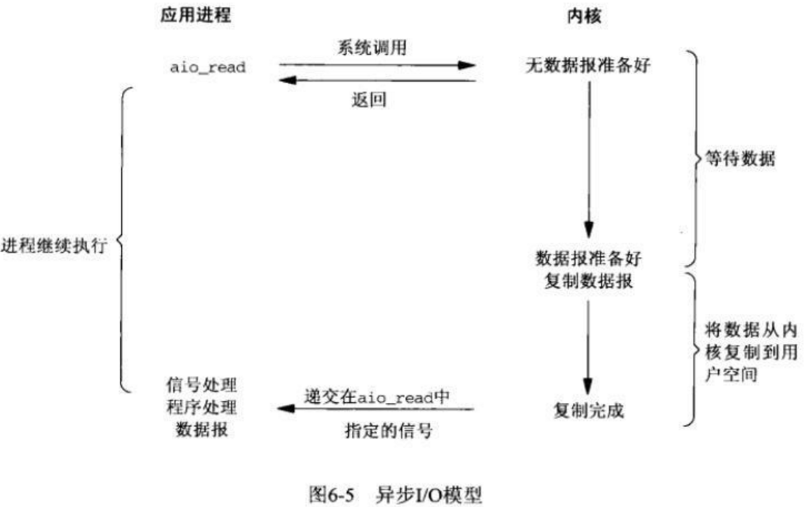

# 面试题目 第三部分 Linux操作系统

## 快速索引

| 第一节                               | 第二节                           | 第三节                    | 第四节                                 |
| ------------------------------------ | -------------------------------- | ------------------------- | -------------------------------------- |
| [操作系统基础](#第一节-操作系统基础) | [进程和线程](#第二节-进程和线程) | [I/O模型](#第三节-IO模型) | [Linux基本操作](#第四节-Linux基本操作) |

## 第一节 操作系统基础

### #00 什么是大端和小端？如何判断一个系统是大端还是小端？

大端就是高位字节存放在内存的低地址段，低位字节存放在内存的高地址段；

小端就是低位字节存放在内存的低地址段，高位字节存放在内存的高地址段；

判断方法：

```cpp
union {
    short val;
    char c[sizeof(short)];
} test;
test.val = 0x0102;
if (test.c[0] == 0x01 && test.c[1] == 0x02)
    cout << "big endian" << endl;
else
    cout << "little endian" << endl;
```

### #01 处理器的状态可以分为哪几种？

- 内核态，运行于进程上下文，内核代表进程运行于内核空间；
- 内核态，运行于中断上下文，内核代表硬件运行于内核空间；
- 用户态，运行于用户空间。

### #02 并行和并发有什么区别？

- 并行是指在同一时刻，有多条指令在多个处理器上同时执行，无论从微观还是宏观上来看，都是多个独立任务同时执行，适用于资源充足的情况，如多核；
- 并发是指在同一时刻只能有一条指令执行，但多个指令被快速地轮换执行，使得从微观来看不是多个独立任务同时执行，但从宏观来看是同时执行，适用于资源有限的情况，如单核。

### #03 程序编译的顺序是什么？

1. 预处理：源代码经过预处理器，生成一个`.i`中间文件，这个阶段会把`#include`的头文件内容进行替换，并处理宏定义；
2. 编译：`.i`中间文件生成`.s`汇编文件；
3. 汇编：`.s`汇编文件经过汇编器生成`.obj`目标文件；
4. 链接：`.obj`目标文件经过链接器，与`lib`静态链接库和`dll`动态链接库生成可执行文件。

### #04 库函数与系统调用有什么区别？

- 库函数属于语言或应用程序的一部分，而系统调用是内核提供给应用程序的接口，属于系统的一部分；
- 库函数在用户地址空间执行，运行时间属于用户时间，开销较小；而系统调用是在内核地址空间执行，运行时间属于系统时间，开销较大；
- 库函数采用缓冲区技术，可以在读写文件时减少系统调用次数，从而提高效率。

## 第二节 进程和线程

### #00 进程和线程有什么区别？

- 进程是资源分配的最小单位，拥有独立的地址空间，每启动一个进程，系统都会建立数据表来维护其代码段、堆栈段和数据段；创建和切换进程的开销较大；进程间通信较复杂；多进程程序更加安全，进程间互不影响。
- 线程是程序执行的最小单位，没有独立的地址空间；创建和切换线程的开销较小；线程间通信较方便；多线程程序不易维护，线程间相互影响。

### #01 多进程和多线程有什么区别？

- 多进程中数据是分离的，这样共享复杂，同步简单；而多线程中数据是共享的，这样共享简单，同步复杂；
- 进程创建、销毁和切换比较复杂，速度较慢；线程创建、销毁和切换比较简单，速度较快；
- 进程占用内存多，CPU利用率低；线程占用内存少，CPU利用率高；
- 多进程的编程和调试比较简单，多线程的编程和调试比较复杂；
- 进程间不会相互影响；而一个线程挂掉将导致整个进程挂掉；
- 多进程适用于多核、多机分布；多线程适用于多核分布。

### #02 多进程和多线程之间如何选择？

- 使用多进程的场景：弱相关的任务、需要拓展到多机分布的任务；
- 使用多线程的场景：需要频繁创建和销毁的任务(如Web服务器)、需要进行大量计算的任务、强相关的任务、需要拓展到多核分布的任务。

### #03 进程的组成部分有哪些？

进程通常由进程控制块和相应的地址空间组成；

Linux环境下，进程控制块主要包含：

- 进程标识符(即进程ID)；
- 进程的当前状态；
- 相应的进程控制信息；

地址空间又可以分为：

- 文本段：存放相应的程序代码；
- 用户数据段：存放相应的程序处理数据；
- 系统数据段：存放相应的程序运行环境。

### #04 进程的基本状态有哪些？

创建、就绪、执行、等待和终止。

### #05 进程间的通信方式有哪些？

- 匿名管道`pipe`：半双工的通信方式，数据只能单向流动，且只能在有亲缘关系的进程间使用；
- 有名管道`named pipe`：与`pipe`相似，但允许在无亲缘关系的进程间使用；
- 消息队列`message queue`：消息链表，存放在内核中并由消息队列标识符进行标识，克服了信号传递信息少、管道只能承载无格式字节流以及缓冲区大小受限等缺点；
- 共享存储`shared memory`：映射一段能够被其他进程访问的内存，一般与信号量配合使用；
- 信号量`semophore`：计数器，用来控制多个进程对共享资源的访问，常常作为锁机制，用于不同进程间或同一进程内不同线程间的同步；
- 套接字`socket`：可用于不同机器间的进程通信；
- 信号`signal`：比较复杂，用于通知进程某个事件已经发生。

### #06 进程的上下文可以分为哪几个部分？

- 用户级上下文：正文、数据、用户堆栈以及共享存储区；
- 寄存器上下文：通用寄存器、程序寄存器(IP)、处理器状态寄存器(EFLAGS)、栈指针(ESP)；
- 系统级上下文：进程控制块(task_struct)、内存管理信息(mm_struct、vm_area_struct、pgd、pte)、内核栈。

### #07 什么是进程切换/上下文切换？

进程切换即上下文切换，是指处理器从一个进程切换到另一个进程，内核在处理器上对于进程进行以下操作：

1. 挂起一个进程，将这个进程在处理器中的状态（即上下文）存储于内存中；
2. 在内存中检索下一个进程的上下文，并将其在CPU的寄存器中恢复；
3. 跳转到程序计数器所指向的位置（即跳转到进程被中断时的代码行），以恢复该进程。

### #08 进程调度算法有哪几种？

- 先来先服务(FCFS)：有利于长进程、CPU繁忙的进程，不利于短进程、I/O繁忙的进程；
- 短作业优先(SJF)：对预计执行时间短的进程优先分派处理机，通常后来的短进程不抢先正在执行的进程；相比于FCFS算法，SJF可以改善平均周转时间和平均带权周转时间，缩短进程的等待时间，提高系统的吞吐量，但是不利于长进程，而且未能根据进程的紧迫程度来划分优先级，以及难以准确估计进程的执行时间，从而影响性能；
- 最高响应比优先(HRRN)：FCFS只考虑等待时间，SJF只考虑执行时间，而HRRN同时考虑每个作业的等待时间和执行时间，定义响应比$R=(W+T)=1+W/T$，其中$W$为等待时间，$T$为执行时间；由于每次调度前都要计算响应比，系统开销相应增加；
- 时间片轮转(RR)：使得进程以FCFS的方式按时间片轮流使用CPU，每次调度时将CPU分派给队首进程，让其执行一个时间片，其长度从几ms到几百ms，当一个时间片结束时，发生时钟中断，调度程序据此暂停当前进程的执行，将其送到就绪队列的末尾，使其出让CPU，并通过上下文切换执行当前的队首进程；不利于处理紧急作业，而且时间片的大小对系统性能的影响很大，因此时间片的大小应适当；
  - 那么应该如何确定时间片的大小？
    - 系统对响应时间的要求；
    - 就绪队列中进程的时间；
    - 系统的处理能力；
- 多级反馈队列(MFQ)：进程在不同优先级的队列间迁移，首先调度优先级高的队列中的进程，只有优先级高的队列为空时才去调度优先级低的队列中的进程；对于同一个队列中的进程，按照时间片轮转的方式进行调度，如果N个时间片后依然未能完成，则进入优先级低的队列等待；在低优先级的队列中的进程在运行时，又有新到达的作业，那么在运行完这个时间片后，CPU分配给新到达的作业，即抢占式。

### #09 什么是孤儿进程？什么是僵尸进程？僵尸进程有什么危害？如何解决？

- 孤儿进程：一个父进程退出，而它的一个或多个子进程还在运行，那么这些子进程将成为孤儿进程，将被`init`进程（进程号为1）所收养，并由`init`进程对这些子进程完成状态收集工作；

- 僵尸进程：一个进程使用`fork`创建子进程，如果子进程退出，而父进程并未调用`wait`或`waitpid`来获取子进程的状态信息，子进程的进程描述符仍然保存在系统中，那么这种子进程将成为僵尸进程。

  僵尸进程的危害：在子进程退出的时候，内核释放该子进程所有的资源，但仍保留进程号、退出状态、运行时间等信息，直到父进程通过`wait`或`waitpid`对其进行释放；但如果父进程不对保留信息进行释放，进程号会一直被占用，然而系统所能使用的进程号是有限的，如果产生大量的僵尸进程，系统将因没有可用的进程号而导致系统不能产生新的进程。

  解决僵尸进程的方法：

  - 父进程通过`wait`和`waitpid`等函数等待子进程结束，但这样会导致父进程挂起；
  - 如果父进程很忙，那么可用`signal`函数为`SIGCHLD`安装`handler`，这样当子进程结束后，父进程会收到信号，在`handler`中调用`wait`回收；
  - 如果父进程不关心子进程何时结束，那么可以用`signal(SIGCHLD, SIG_IGN)`通知内核，这样当子进程结束后，内核会对其进行回收；
  - `fork`两次，父进程`fork`一个子进程后继续工作，子进程`fork`一个孙进程后退出，那么孙进程将被`init`接管，这样当子进程结束后，内核会对其进行回收。

### #10 如何使用`fork()`函数？

```cpp
pid_t pid = fork();
    switch (pid) {
        case -1:
            cerr << "Fork is failed!\n";
            break;
        case 0:
            cout << "This is child process, pid: " << getpid();
            cout << ", parent pid: " << getppid() << endl;
            break;
        default:
            cout << "This is parent process, pid: " << getpid();
            cout<< ", child pid: " << pid << endl;
    }
```

`fork()`函数创建的子进程会完全复制父进程的资源，代码也不例外，但是`fork()`函数在父进程中返回的是子进程的`pid`，如果为`-1`则说明创建子进程失败；在子进程中返回的是`0`，可以借此区分父进程和子进程。

### #11 线程同步的方法有哪些？

- 临界区：串行化访问公共资源或代码段，速度较快；
- 互斥量：采用互斥对象机制，只有拥有互斥对象的线程才能访问公共资源，而因为互斥对象只有一个，所以可以保证公共资源不会被多个线程同时访问；
- 信号量：允许多个线程在同一时刻访问同一公共资源，但限制同一时刻访问该公共资源的最大线程数量；
- 事件：使用通知操作的方式，可以方便地实现多线程优先级的比较操作。

### #12 什么是临界区？进程进入临界区的调度原则是什么？

临界区是一段针对共享资源的保护代码，该保护代码在任意时刻只允许一个线程对共享资源访问。

线程进入临界区的调度原则是：

1. 如果有若干进程要求进入空闲的临界区，则每次只允许一个进程进入；
2. 任何时候，处于临界区内的进程不可多于一个；
3. 进入临界区的进程要在有限时间内退出，以便其他进程能及时进入临界区；
4. 如果进程不能进入临界区，则应让出CPU，避免进程出现忙等现象。

### #13 线程创建的方式有哪几种？

1. 使用初始函数创建线程；
2. 使用类对象创建线程；
3. 使用lambda匿名函数创建线程。

### #14 为什么需要使用线程池？

- 过于频繁地创建或销毁线程会带来大量系统开销，影响处理效率；
- 线程并发数量过多，抢占系统资源从而导致阻塞；
- 可以对线程进行一些简单的管理，如延时执行、定时循环执行。

### #15 哪些资源是线程共享的？哪些资源是线程私有的？

- 线程共享：进程代码段、进程的公有数据、进程打开的文件描述符、信号的处理器、进程的当前目录和进程用户ID与进程组ID；
- 线程私有：线程ID、寄存器里的值、栈、线程的私有数据、线程的优先级、信号屏蔽码、错误返回码。

### #16 多线程锁的种类有哪些？

互斥锁、递归锁、自旋锁、读写锁。

### #17 什么是死锁？死锁产生的原因是什么？死锁有哪些必要条件？

死锁是指多个进程因竞争资源而造成的一种僵局（互相等待），若无外力作用，则这些进程都将无法向前推进。

死锁产生的原因：系统资源竞争、线程运行推进顺序不当。

死锁的四个必要条件：

1. 互斥条件：在一段时间内某资源只能被一个进程使用，如果有其他进程请求该资源，则请求进程只能等待；
2. 请求与保持条件：进程已经保持了至少一个资源，但又提出新的资源请求，而该资源已被其他进程占用，此时请求进程被阻塞，对自己已有资源保持不放；
3. 不可剥夺条件：进程所获得的资源在未使用完毕时，不能被其他进程强行夺走，即只能由获得该资源的进程主动释放；
4. 循环等待条件：若干进程间形成首尾相接、循环等待资源的关系。

### #18 如何预防死锁？如何避免死锁？如何检测死锁？如何解除死锁？

预防死锁的方法：核心思想是破坏死锁的四个必要条件之一，即

- 破坏请求与保持条件：采用预先静态分配的方法，即进程在运行前一次申请完它所需要的全部资源，在未满足全部资源时不运行；但系统资源被严重浪费，且易导致“饥饿”状态；
- 破坏不可剥夺条件：当一个进程请求新的资源但未满足时，该进程必须释放已经保持的所有资源，以后需要时再重新申请；但反复地申请和释放资源会增加系统开销，降低系统吞吐量；
- 破坏循环等待条件：采用顺序资源分配法，即给系统中的资源编号，规定每个进程必须按照编号顺序申请资源；但限制了新类型设备的增加。

避免死锁的方法：

- 进程启动拒绝：如果一个进程的请求会导致死锁，则不执行该进程；
- 资源分配拒绝：又名银行家算法，如果一个进程增加的资源请求会导致死锁，则不允许分配。

检测死锁的方法：

- 为每个进程和每个资源制定唯一编号；
- 设定一张资源分配表，记录各进程与占用资源之间的对应关系；
- 设定一张进程等待表，记录各进程与申请资源之间的对应关系；
- 判断是否出现环路，是则引发死锁。

解除死锁的方法：

- 资源剥夺法：挂起某些死锁进程，并释放其所保持的资源，分配给其他死锁进程，但应防止被挂起的进程长时间得不到资源，而处于资源匮乏的状态；
- 撤销进程法：强制撤销部分、甚至全部死锁进程，并释放其所保持的资源；撤销顺序可以按照进程优先级和撤销进程代价的高低来进行；
- 进程回退法：让某些死锁进行回退到足以回避死锁的地步，回退过程中自愿释放自愿，但要求系统保留进程历史信息，设置还原点。

### #19 如何使用单线程处理高并发？

在单线程模型中，采用多路复用I/O来提高单线程处理多个请求的能力，然后采用事件驱动模型，基于异步回调来处理事件。

## 第三节 I/O模型

### #00 同步和异步有什么区别？

- 同步是指在发起一个调用之后，调用者需要一直等待调用结果的通知，才能进行后续的操作；
- 异步是指在发起一个调用之后，调用者不能立即得到调用结果的返回，需要被调用者通过状态、通知和回调来通知调用者。

需要注意的是，同步/异步强调的是消息通信机制。

### #01 阻塞和非阻塞有什么区别？

- 阻塞是指在发起一个调用之后，在消息返回之前，当前进程/线程会被挂起，直到有消息返回，当前进程/线程才会被激活；
- 非阻塞是指在发起一个调用之后，不会阻塞当前进程/线程，而会立即返回。

需要注意的是，阻塞/非阻塞强调的是等待消息时的状态。

### #02 Linux的I/O模型包含哪五种？各自有什么特点？

- 同步I/O

  - 阻塞I/O：进程保持阻塞状态，直到数据拷贝完成；

    

  - 非阻塞I/O：轮询检查内核数据，直到数据准备好，再拷贝数据到进程，进行数据处理；需要注意的是，拷贝数据的过程中，进程依然是阻塞装填；

    

  - 多路复用I/O：进程调用`select`、`poll`、`epoll`函数，保持阻塞状态，但与阻塞I/O不同的是，这些函数可以同时处理多个I/O；

    

  - 信号驱动I/O：首先建立一个信号处理函数，进程继续运行并不阻塞，当数据准备好时，进程会收到一个`SIGIO`信号，可以在信号处理函数中处理数据；

    

- 异步I/O：在发起一个调用之后，调用者不能立即得到调用结果的返回，需要被调用者通过状态、通知和回调来通知调用者。

  

这五种模型的比较如下图所示：


### #03 `select`、`poll`、`epoll`之间有什么区别？

- `select`本质上是通过设置和轮询`fd_set`来检查是否有就绪的文件描述符，其缺点在于：

  - 单个进程可监视的文件描述符数量较少，在32位机器上默认为1024个，在64位机器上默认为2048个；
  - 每次调用`select`都需要把`fd_set`从用户空间拷贝到内核空间，文件描述符较多时开销较大；
  - 每次调用`select`都需要线性扫描`fd_set`，文件描述符较多时开销较大。

- `poll`与`select`相似，不同之处在于`poll`使用`pollfd`链表结构保存文件描述符，因此与`select`相比，没有文件描述符数量的限制。

- `epoll`提供了三个函数：

  - `epoll_create`用于创建一个`epoll`句柄；
  - `epoll_ctl`用于注册要监听的事件类型，其特点是：
    - 每次注册新的事件到`epoll`句柄中时，会把所有的文件描述符拷贝进内核空间，保证了每个文件描述符在整个过程中只拷贝一次，不会出现重复拷贝；
    - 为每个文件描述符指定一个回调函数，当事件发生时，就会调用这个回调函数，把就绪的文件描述符加入到就绪链表中；
  - `epoll_wait`用于等待事件的发生，唤醒等待中的进程；

  `epoll`对文件描述符的操作有两种模式：

  - 水平触发：当`epoll_wait`检测到描述符事件发生并将此事件通知应用程序，应用程序可以不立即处理该事件，下次调用`epoll_wait`时，将会再次响应应用程序并通知此事件；
  - 边缘触发：当`epoll_wait`检测到描述符事件发生并将此事件通知应用程序，应用程序必须立即处理该事件，如果不处理，下次调用`epoll_wait`时，不会再次响应应用程序并通知此事件；

需要注意的是，表面上看`epoll`的性能最好，但是连接数量较少并且都十分活跃的情况下，`select`和`poll`的性能可能较好，因为`epoll`的通知机制需要使用回调函数。

## 第四节 Linux基本操作

# Linux
<!-- GFM-TOC -->
* [Linux](#linux)
    * [前言](#前言)
    * [一、常用操作以及概念](#一常用操作以及概念)
        * [快捷键](#快捷键)
        * [求助](#求助)
        * [关机](#关机)
        * [PATH](#path)
        * [sudo](#sudo)
        * [包管理工具](#包管理工具)
        * [发行版](#发行版)
        * [VIM 三个模式](#vim-三个模式)
        * [GNU](#gnu)
        * [开源协议](#开源协议)
    * [二、磁盘](#二磁盘)
        * [磁盘接口](#磁盘接口)
        * [磁盘的文件名](#磁盘的文件名)
    * [三、分区](#三分区)
        * [分区表](#分区表)
        * [开机检测程序](#开机检测程序)
    * [四、文件系统](#四文件系统)
        * [分区与文件系统](#分区与文件系统)
        * [组成](#组成)
        * [文件读取](#文件读取)
        * [磁盘碎片](#磁盘碎片)
        * [block](#block)
        * [inode](#inode)
        * [目录](#目录)
        * [日志](#日志)
        * [挂载](#挂载)
        * [目录配置](#目录配置)
    * [五、文件](#五文件)
        * [文件属性](#文件属性)
        * [文件与目录的基本操作](#文件与目录的基本操作)
        * [修改权限](#修改权限)
        * [默认权限](#默认权限)
        * [目录的权限](#目录的权限)
        * [链接](#链接)
        * [获取文件内容](#获取文件内容)
        * [指令与文件搜索](#指令与文件搜索)
    * [六、压缩与打包](#六压缩与打包)
        * [压缩文件名](#压缩文件名)
        * [压缩指令](#压缩指令)
        * [打包](#打包)
    * [七、Bash](#七bash)
        * [特性](#特性)
        * [变量操作](#变量操作)
        * [指令搜索顺序](#指令搜索顺序)
        * [数据流重定向](#数据流重定向)
    * [八、管道指令](#八管道指令)
        * [提取指令](#提取指令)
        * [排序指令](#排序指令)
        * [双向输出重定向](#双向输出重定向)
        * [字符转换指令](#字符转换指令)
        * [分区指令](#分区指令)
    * [九、正则表达式](#九正则表达式)
        * [grep](#grep)
        * [printf](#printf)
        * [awk](#awk)
    * [十、进程管理](#十进程管理)
        * [查看进程](#查看进程)
        * [进程状态](#进程状态)
        * [SIGCHLD](#sigchld)
        * [wait()](#wait)
        * [waitpid()](#waitpid)
        * [孤儿进程](#孤儿进程)
        * [僵尸进程](#僵尸进程)
    * [参考资料](#参考资料)
<!-- GFM-TOC -->


## 前言

为了便于理解，本文从常用操作和概念开始讲起。虽然已经尽量做到简化，但是涉及到的内容还是有点多。在面试中，Linux 知识点相对于网络和操作系统等知识点而言不是那么重要，只需要重点掌握一些原理和命令即可。为了方便大家准备面试，在此先将一些比较重要的知识点列出来：

- 能简单使用 cat，grep，cut 等命令进行一些操作；
- 文件系统相关的原理，inode 和 block 等概念，数据恢复；
- 硬链接与软链接；
- 进程管理相关，僵尸进程与孤儿进程，SIGCHLD 。

## 一、常用操作以及概念

### 快捷键

- Tab：命令和文件名补全；
- Ctrl+C：中断正在运行的程序；
- Ctrl+D：结束键盘输入（End Of File，EOF）

### 求助

#### 1. --help

指令的基本用法与选项介绍。

#### 2. man

man 是 manual 的缩写，将指令的具体信息显示出来。

当执行 `man date` 时，有 DATE(1) 出现，其中的数字代表指令的类型，常用的数字及其类型如下：

| 代号 | 类型 |
| :--: | -- |
| 1 | 用户在 shell 环境中可以操作的指令或者可执行文件 |
| 5 | 配置文件 |
| 8 | 系统管理员可以使用的管理指令 |

#### 3. info

info 与 man 类似，但是 info 将文档分成一个个页面，每个页面可以跳转。

#### 4. doc

/usr/share/doc 存放着软件的一整套说明文件。

### 关机

#### 1. who

在关机前需要先使用 who 命令查看有没有其它用户在线。

#### 2. sync

为了加快对磁盘文件的读写速度，位于内存中的文件数据不会立即同步到磁盘，因此关机之前需要先进行 sync 同步操作。

#### 3. shutdown

```html
## shutdown [-krhc] 时间 [信息]
-k ： 不会关机，只是发送警告信息，通知所有在线的用户
-r ： 将系统的服务停掉后就重新启动
-h ： 将系统的服务停掉后就立即关机
-c ： 取消已经在进行的 shutdown
```

### PATH

可以在环境变量 PATH 中声明可执行文件的路径，路径之间用 : 分隔。

```html
/usr/local/bin:/usr/bin:/usr/local/sbin:/usr/sbin:/home/dmtsai/.local/bin:/home/dmtsai/bin
```

### sudo

sudo 允许一般用户使用 root 可执行的命令，不过只有在 /etc/sudoers 配置文件中添加的用户才能使用该指令。

### 包管理工具

RPM 和 DPKG 为最常见的两类软件包管理工具：

- RPM 全称为 Redhat Package Manager，最早由 Red Hat 公司制定实施，随后被 GNU 开源操作系统接受并成为许多 Linux 系统的既定软件标准。YUM 基于 RPM，具有依赖管理和软件升级功能。
- 与 RPM 竞争的是基于 Debian 操作系统的 DEB 软件包管理工具 DPKG，全称为 Debian Package，功能方面与 RPM 相似。

### 发行版

Linux 发行版是 Linux 内核及各种应用软件的集成版本。

| 基于的包管理工具 | 商业发行版 | 社区发行版 |
| :--: | :--: | :--: |
| RPM | Red Hat | Fedora / CentOS |
| DPKG | Ubuntu | Debian |

### VIM 三个模式

<div align="center">  </div><br>


- 一般指令模式（Command mode）：VIM 的默认模式，可以用于移动游标查看内容；
- 编辑模式（Insert mode）：按下 "i" 等按键之后进入，可以对文本进行编辑；
- 指令列模式（Bottom-line mode）：按下 ":" 按键之后进入，用于保存退出等操作。

在指令列模式下，有以下命令用于离开或者保存文件。

| 命令 | 作用 |
| :--: | :--: |
| :w | 写入磁盘|
| :w! | 当文件为只读时，强制写入磁盘。到底能不能写入，与用户对该文件的权限有关 |
| :q | 离开 |
| :q! | 强制离开不保存 |
| :wq | 写入磁盘后离开 |
| :wq!| 强制写入磁盘后离开 |

### GNU

GNU 计划，译为革奴计划，它的目标是创建一套完全自由的操作系统，称为 GNU，其内容软件完全以 GPL 方式发布。其中 GPL 全称为 GNU 通用公共许可协议（GNU General Public License），包含了以下内容：

- 以任何目的运行此程序的自由；
- 再复制的自由；
- 改进此程序，并公开发布改进的自由。

### 开源协议

- [Choose an open source license](https://choosealicense.com/)
- [如何选择开源许可证？](http://www.ruanyifeng.com/blog/2011/05/how_to_choose_free_software_licenses.html)

## 二、磁盘

### 磁盘接口

#### 1. IDE

IDE（ATA）全称 Advanced Technology Attachment，接口速度最大为 133MB/s，因为并口线的抗干扰性太差，且排线占用空间较大，不利电脑内部散热，已逐渐被 SATA 所取代。

<div align="center">  </div><br>

#### 2. SATA

SATA 全称 Serial ATA，也就是使用串口的 ATA 接口，抗干扰性强，且对数据线的长度要求比 ATA 低很多，支持热插拔等功能。SATA-II 的接口速度为 300MB/s，而 SATA-III 标准可达到 600MB/s 的传输速度。SATA 的数据线也比 ATA 的细得多，有利于机箱内的空气流通，整理线材也比较方便。

<div align="center">  </div><br>

#### 3. SCSI

SCSI 全称是 Small Computer System Interface（小型机系统接口），SCSI 硬盘广为工作站以及个人电脑以及服务器所使用，因此会使用较为先进的技术，如碟片转速 15000rpm 的高转速，且传输时 CPU 占用率较低，但是单价也比相同容量的 ATA 及 SATA 硬盘更加昂贵。

<div align="center">  </div><br>

#### 4. SAS

SAS（Serial Attached SCSI）是新一代的 SCSI 技术，和 SATA 硬盘相同，都是采取序列式技术以获得更高的传输速度，可达到 6Gb/s。此外也通过缩小连接线改善系统内部空间等。

<div align="center">  </div><br>

### 磁盘的文件名

Linux 中每个硬件都被当做一个文件，包括磁盘。磁盘以磁盘接口类型进行命名，常见磁盘的文件名如下：

- IDE 磁盘：/dev/hd[a-d]
- SATA/SCSI/SAS 磁盘：/dev/sd[a-p]

其中文件名后面的序号的确定与系统检测到磁盘的顺序有关，而与磁盘所插入的插槽位置无关。

## 三、分区

### 分区表

磁盘分区表主要有两种格式，一种是限制较多的 MBR 分区表，一种是较新且限制较少的 GPT 分区表。

#### 1. MBR

MBR 中，第一个扇区最重要，里面有主要开机记录（Master boot record, MBR）及分区表（partition table），其中主要开机记录占 446 bytes，分区表占 64 bytes。

分区表只有 64 bytes，最多只能存储 4 个分区，这 4 个分区为主分区（Primary）和扩展分区（Extended）。其中扩展分区只有一个，它使用其它扇区来记录额外的分区表，因此通过扩展分区可以分出更多分区，这些分区称为逻辑分区。

Linux 也把分区当成文件，分区文件的命名方式为：磁盘文件名 + 编号，例如 /dev/sda1。注意，逻辑分区的编号从 5 开始。

#### 2. GPT

扇区是磁盘的最小存储单位，旧磁盘的扇区大小通常为 512 bytes，而最新的磁盘支持 4 k。GPT 为了兼容所有磁盘，在定义扇区上使用逻辑区块地址（Logical Block Address, LBA），LBA 默认大小为 512 bytes。

GPT 第 1 个区块记录了主要开机记录（MBR），紧接着是 33 个区块记录分区信息，并把最后的 33 个区块用于对分区信息进行备份。这 33 个区块第一个为 GPT 表头纪录，这个部份纪录了分区表本身的位置与大小和备份分区的位置，同时放置了分区表的校验码 (CRC32)，操作系统可以根据这个校验码来判断 GPT 是否正确。若有错误，可以使用备份分区进行恢复。

GPT 没有扩展分区概念，都是主分区，每个 LBA 可以分 4 个分区，因此总共可以分 4 * 32 = 128 个分区。

MBR 不支持 2.2 TB 以上的硬盘，GPT 则最多支持到 2<sup>33</sup> TB = 8 ZB。

<div align="center">  </div><br>

### 开机检测程序

#### 1. BIOS

BIOS（Basic Input/Output System，基本输入输出系统），它是一个固件（嵌入在硬件中的软件），BIOS 程序存放在断电后内容不会丢失的只读内存中。

<div align="center">  </div><br>

BIOS 是开机的时候计算机执行的第一个程序，这个程序知道可以开机的磁盘，并读取磁盘第一个扇区的主要开机记录（MBR），由主要开机记录（MBR）执行其中的开机管理程序，这个开机管理程序会加载操作系统的核心文件。

主要开机记录（MBR）中的开机管理程序提供以下功能：选单、载入核心文件以及转交其它开机管理程序。转交这个功能可以用来实现多重引导，只需要将另一个操作系统的开机管理程序安装在其它分区的启动扇区上，在启动开机管理程序时，就可以通过选单选择启动当前的操作系统或者转交给其它开机管理程序从而启动另一个操作系统。

下图中，第一扇区的主要开机记录（MBR）中的开机管理程序提供了两个选单：M1、M2，M1 指向了 Windows 操作系统，而 M2 指向其它分区的启动扇区，里面包含了另外一个开机管理程序，提供了一个指向 Linux 的选单。

<div align="center">  </div><br>

安装多重引导，最好先安装 Windows 再安装 Linux。因为安装 Windows 时会覆盖掉主要开机记录（MBR），而 Linux 可以选择将开机管理程序安装在主要开机记录（MBR）或者其它分区的启动扇区，并且可以设置开机管理程序的选单。

#### 2. UEFI

BIOS 不可以读取 GPT 分区表，而 UEFI 可以。

## 四、文件系统

### 分区与文件系统

对分区进行格式化是为了在分区上建立文件系统。一个分区通常只能格式化为一个文件系统，但是磁盘阵列等技术可以将一个分区格式化为多个文件系统。

### 组成

最主要的几个组成部分如下：

- inode：一个文件占用一个 inode，记录文件的属性，同时记录此文件的内容所在的 block 编号；
- block：记录文件的内容，文件太大时，会占用多个 block。

除此之外还包括：

- superblock：记录文件系统的整体信息，包括 inode 和 block 的总量、使用量、剩余量，以及文件系统的格式与相关信息等；
- block bitmap：记录 block 是否被使用的位图。

<div align="center">  </div><br>

### 文件读取

对于 Ext2 文件系统，当要读取一个文件的内容时，先在 inode 中查找文件内容所在的所有 block，然后把所有 block 的内容读出来。

<div align="center">  </div><br>

而对于 FAT 文件系统，它没有 inode，每个 block 中存储着下一个 block 的编号。

<div align="center">  </div><br>

### 磁盘碎片

指一个文件内容所在的 block 过于分散，导致磁盘磁头移动距离过大，从而降低磁盘读写性能。

### block

在 Ext2 文件系统中所支持的 block 大小有 1K，2K 及 4K 三种，不同的大小限制了单个文件和文件系统的最大大小。

| 大小 | 1KB | 2KB | 4KB |
| :---: | :---: | :---: | :---: |
| 最大单一文件 | 16GB | 256GB | 2TB |
| 最大文件系统 | 2TB | 8TB | 16TB |

一个 block 只能被一个文件所使用，未使用的部分直接浪费了。因此如果需要存储大量的小文件，那么最好选用比较小的 block。

### inode

inode 具体包含以下信息：

- 权限 (read/write/excute)；
- 拥有者与群组 (owner/group)；
- 容量；
- 建立或状态改变的时间 (ctime)；
- 最近读取时间 (atime)；
- 最近修改时间 (mtime)；
- 定义文件特性的旗标 (flag)，如 SetUID...；
- 该文件真正内容的指向 (pointer)。

inode 具有以下特点：

- 每个 inode 大小均固定为 128 bytes (新的 ext4 与 xfs 可设定到 256 bytes)；
- 每个文件都仅会占用一个 inode。

inode 中记录了文件内容所在的 block 编号，但是每个 block 非常小，一个大文件随便都需要几十万的 block。而一个 inode 大小有限，无法直接引用这么多 block 编号。因此引入了间接、双间接、三间接引用。间接引用让 inode 记录的引用 block 块记录引用信息。

<div align="center">  </div><br>

### 目录

建立一个目录时，会分配一个 inode 与至少一个 block。block 记录的内容是目录下所有文件的 inode 编号以及文件名。

可以看到文件的 inode 本身不记录文件名，文件名记录在目录中，因此新增文件、删除文件、更改文件名这些操作与目录的写权限有关。

### 日志

如果突然断电，那么文件系统会发生错误，例如断电前只修改了 block bitmap，而还没有将数据真正写入 block 中。

ext3/ext4 文件系统引入了日志功能，可以利用日志来修复文件系统。

### 挂载

挂载利用目录作为文件系统的进入点，也就是说，进入目录之后就可以读取文件系统的数据。

### 目录配置

为了使不同 Linux 发行版本的目录结构保持一致性，Filesystem Hierarchy Standard (FHS) 规定了 Linux 的目录结构。最基础的三个目录如下：

- / (root, 根目录)
- /usr (unix software resource)：所有系统默认软件都会安装到这个目录；
- /var (variable)：存放系统或程序运行过程中的数据文件。

<div align="center">  </div><br>

## 五、文件

### 文件属性

用户分为三种：文件拥有者、群组以及其它人，对不同的用户有不同的文件权限。

使用 ls 查看一个文件时，会显示一个文件的信息，例如 `drwxr-xr-x 3 root root 17 May 6 00:14 .config`，对这个信息的解释如下：

- drwxr-xr-x：文件类型以及权限，第 1 位为文件类型字段，后 9 位为文件权限字段
- 3：链接数
- root：文件拥有者
- root：所属群组
- 17：文件大小
- May 6 00:14：文件最后被修改的时间
- .config：文件名

常见的文件类型及其含义有：

- d：目录
- -：文件
- l：链接文件

9 位的文件权限字段中，每 3 个为一组，共 3 组，每一组分别代表对文件拥有者、所属群组以及其它人的文件权限。一组权限中的 3 位分别为 r、w、x 权限，表示可读、可写、可执行。

文件时间有以下三种：

- modification time (mtime)：文件的内容更新就会更新；
- status time (ctime)：文件的状态（权限、属性）更新就会更新；
- access time (atime)：读取文件时就会更新。

### 文件与目录的基本操作

#### 1. ls

列出文件或者目录的信息，目录的信息就是其中包含的文件。

```html
## ls [-aAdfFhilnrRSt] file|dir
-a ：列出全部的文件
-d ：仅列出目录本身
-l ：以长数据串行列出，包含文件的属性与权限等等数据
```

#### 2. cd

更换当前目录。

```
cd [相对路径或绝对路径]
```

#### 3. mkdir

创建目录。

```
## mkdir [-mp] 目录名称
-m ：配置目录权限
-p ：递归创建目录
```

#### 4. rmdir

删除目录，目录必须为空。

```html
rmdir [-p] 目录名称
-p ：递归删除目录
```

#### 5. touch

更新文件时间或者建立新文件。

```html
## touch [-acdmt] filename
-a ： 更新 atime
-c ： 更新 ctime，若该文件不存在则不建立新文件
-m ： 更新 mtime
-d ： 后面可以接更新日期而不使用当前日期，也可以使用 --date="日期或时间"
-t ： 后面可以接更新时间而不使用当前时间，格式为[YYYYMMDDhhmm]
```

#### 6. cp

复制文件。如果源文件有两个以上，则目的文件一定要是目录才行。

```html
cp [-adfilprsu] source destination
-a ：相当于 -dr --preserve=all
-d ：若来源文件为链接文件，则复制链接文件属性而非文件本身
-i ：若目标文件已经存在时，在覆盖前会先询问
-p ：连同文件的属性一起复制过去
-r ：递归复制
-u ：destination 比 source 旧才更新 destination，或 destination 不存在的情况下才复制
--preserve=all ：除了 -p 的权限相关参数外，还加入 SELinux 的属性, links, xattr 等也复制了
```

#### 7. rm

删除文件。

```html
## rm [-fir] 文件或目录
-r ：递归删除
```

#### 8. mv

移动文件。

```html
## mv [-fiu] source destination
## mv [options] source1 source2 source3 .... directory
-f ： force 强制的意思，如果目标文件已经存在，不会询问而直接覆盖
```

### 修改权限

可以将一组权限用数字来表示，此时一组权限的 3 个位当做二进制数字的位，从左到右每个位的权值为 4、2、1，即每个权限对应的数字权值为 r : 4、w : 2、x : 1。

```html
## chmod [-R] xyz dirname/filename
```

示例：将 .bashrc 文件的权限修改为 -rwxr-xr--。

```html
## chmod 754 .bashrc
```

也可以使用符号来设定权限。

```html
## chmod [ugoa]  [+-=] [rwx] dirname/filename
- u：拥有者
- g：所属群组
- o：其他人
- a：所有人
- +：添加权限
- -：移除权限
- =：设定权限
```

示例：为 .bashrc 文件的所有用户添加写权限。

```html
## chmod a+w .bashrc
```

### 默认权限

- 文件默认权限：文件默认没有可执行权限，因此为 666，也就是 -rw-rw-rw- 。
- 目录默认权限：目录必须要能够进入，也就是必须拥有可执行权限，因此为 777 ，也就是 drwxrwxrwx。

可以通过 umask 设置或者查看默认权限，通常以掩码的形式来表示，例如 002 表示其它用户的权限去除了一个 2 的权限，也就是写权限，因此建立新文件时默认的权限为 -rw-rw-r--。

### 目录的权限

文件名不是存储在一个文件的内容中，而是存储在一个文件所在的目录中。因此，拥有文件的 w 权限并不能对文件名进行修改。

目录存储文件列表，一个目录的权限也就是对其文件列表的权限。因此，目录的 r 权限表示可以读取文件列表；w 权限表示可以修改文件列表，具体来说，就是添加删除文件，对文件名进行修改；x 权限可以让该目录成为工作目录，x 权限是 r 和 w 权限的基础，如果不能使一个目录成为工作目录，也就没办法读取文件列表以及对文件列表进行修改了。

### 链接

<div align="center">  </div><br>


```html
## ln [-sf] source_filename dist_filename
-s ：默认是实体链接，加 -s 为符号链接
-f ：如果目标文件存在时，先删除目标文件
```

#### 1. 实体链接

在目录下创建一个条目，记录着文件名与 inode 编号，这个 inode 就是源文件的 inode。

删除任意一个条目，文件还是存在，只要引用数量不为 0。

有以下限制：不能跨越文件系统、不能对目录进行链接。

```html
## ln /etc/crontab .
## ll -i /etc/crontab crontab
34474855 -rw-r--r--. 2 root root 451 Jun 10 2014 crontab
34474855 -rw-r--r--. 2 root root 451 Jun 10 2014 /etc/crontab
```

#### 2. 符号链接

符号链接文件保存着源文件所在的绝对路径，在读取时会定位到源文件上，可以理解为 Windows 的快捷方式。

当源文件被删除了，链接文件就打不开了。

因为记录的是路径，所以可以为目录建立符号链接。

```html
## ll -i /etc/crontab /root/crontab2
34474855 -rw-r--r--. 2 root root 451 Jun 10 2014 /etc/crontab
53745909 lrwxrwxrwx. 1 root root 12 Jun 23 22:31 /root/crontab2 -> /etc/crontab
```

### 获取文件内容

#### 1. cat

取得文件内容。

```html
## cat [-AbEnTv] filename
-n ：打印出行号，连同空白行也会有行号，-b 不会
```

#### 2. tac

是 cat 的反向操作，从最后一行开始打印。

#### 3. more

和 cat 不同的是它可以一页一页查看文件内容，比较适合大文件的查看。

#### 4. less

和 more 类似，但是多了一个向前翻页的功能。

#### 5. head

取得文件前几行。

```html
## head [-n number] filename
-n ：后面接数字，代表显示几行的意思
```

#### 6. tail

是 head 的反向操作，只是取得是后几行。

#### 7. od

以字符或者十六进制的形式显示二进制文件。

### 指令与文件搜索

#### 1. which

指令搜索。

```html
## which [-a] command
-a ：将所有指令列出，而不是只列第一个
```

#### 2. whereis

文件搜索。速度比较快，因为它只搜索几个特定的目录。

```html
## whereis [-bmsu] dirname/filename
```

#### 3. locate

文件搜索。可以用关键字或者正则表达式进行搜索。

locate 使用 /var/lib/mlocate/ 这个数据库来进行搜索，它存储在内存中，并且每天更新一次，所以无法用 locate 搜索新建的文件。可以使用 updatedb 来立即更新数据库。

```html
## locate [-ir] keyword
-r：正则表达式
```

#### 4. find

文件搜索。可以使用文件的属性和权限进行搜索。

```html
## find [basedir] [option]
example: find . -name "shadow*"
```

**① 与时间有关的选项**  

```html
-mtime  n ：列出在 n 天前的那一天修改过内容的文件
-mtime +n ：列出在 n 天之前 (不含 n 天本身) 修改过内容的文件
-mtime -n ：列出在 n 天之内 (含 n 天本身) 修改过内容的文件
-newer file ： 列出比 file 更新的文件
```

+4、4 和 -4 的指示的时间范围如下：

<div align="center">  </div><br>

**② 与文件拥有者和所属群组有关的选项**  

```html
-uid n
-gid n
-user name
-group name
-nouser ：搜索拥有者不存在 /etc/passwd 的文件
-nogroup：搜索所属群组不存在于 /etc/group 的文件
```

**③ 与文件权限和名称有关的选项**  

```html
-name filename
-size [+-]SIZE：搜寻比 SIZE 还要大 (+) 或小 (-) 的文件。这个 SIZE 的规格有：c: 代表 byte，k: 代表 1024bytes。所以，要找比 50KB 还要大的文件，就是 -size +50k
-type TYPE
-perm mode  ：搜索权限等于 mode 的文件
-perm -mode ：搜索权限包含 mode 的文件
-perm /mode ：搜索权限包含任一 mode 的文件
```

## 六、压缩与打包

### 压缩文件名

Linux 底下有很多压缩文件名，常见的如下：

| 扩展名 | 压缩程序 |
| -- | -- |
| \*.Z | compress |
|\*.zip |  zip |
|\*.gz  | gzip|
|\*.bz2 |  bzip2 |
|\*.xz  | xz |
|\*.tar |  tar 程序打包的数据，没有经过压缩 |
|\*.tar.gz | tar 程序打包的文件，经过 gzip 的压缩 |
|\*.tar.bz2 | tar 程序打包的文件，经过 bzip2 的压缩 |
|\*.tar.xz | tar 程序打包的文件，经过 xz 的压缩 |

### 压缩指令

#### 1. gzip

gzip 是 Linux 使用最广的压缩指令，可以解开 compress、zip 与 gzip 所压缩的文件。

经过 gzip 压缩过，源文件就不存在了。

有 9 个不同的压缩等级可以使用。

可以使用 zcat、zmore、zless 来读取压缩文件的内容。

```html
$ gzip [-cdtv#] filename
-c ：将压缩的数据输出到屏幕上
-d ：解压缩
-t ：检验压缩文件是否出错
-v ：显示压缩比等信息
-# ： # 为数字的意思，代表压缩等级，数字越大压缩比越高，默认为 6
```

#### 2. bzip2

提供比 gzip 更高的压缩比。

查看命令：bzcat、bzmore、bzless、bzgrep。

```html
$ bzip2 [-cdkzv#] filename
-k ：保留源文件
```

#### 3. xz

提供比 bzip2 更佳的压缩比。

可以看到，gzip、bzip2、xz 的压缩比不断优化。不过要注意的是，压缩比越高，压缩的时间也越长。

查看命令：xzcat、xzmore、xzless、xzgrep。

```html
$ xz [-dtlkc#] filename
```

### 打包

压缩指令只能对一个文件进行压缩，而打包能够将多个文件打包成一个大文件。tar 不仅可以用于打包，也可以使用 gzip、bzip2、xz 将打包文件进行压缩。

```html
$ tar [-z|-j|-J] [cv] [-f 新建的 tar 文件] filename...  ==打包压缩
$ tar [-z|-j|-J] [tv] [-f 已有的 tar 文件]              ==查看
$ tar [-z|-j|-J] [xv] [-f 已有的 tar 文件] [-C 目录]    ==解压缩
-z ：使用 zip；
-j ：使用 bzip2；
-J ：使用 xz；
-c ：新建打包文件；
-t ：查看打包文件里面有哪些文件；
-x ：解打包或解压缩的功能；
-v ：在压缩/解压缩的过程中，显示正在处理的文件名；
-f : filename：要处理的文件；
-C 目录 ： 在特定目录解压缩。
```

| 使用方式 | 命令 |
| :---: | --- |
| 打包压缩 | tar -jcv -f filename.tar.bz2 要被压缩的文件或目录名称 |
| 查 看 | tar -jtv -f filename.tar.bz2 |
| 解压缩 | tar -jxv -f filename.tar.bz2 -C 要解压缩的目录 |

## 七、Bash

可以通过 Shell 请求内核提供服务，Bash 正是 Shell 的一种。

### 特性

- 命令历史：记录使用过的命令
- 命令与文件补全：快捷键：tab
- 命名别名：例如 ll 是 ls -al 的别名
- shell scripts
- 通配符：例如 ls -l /usr/bin/X\* 列出 /usr/bin 下面所有以 X 开头的文件

### 变量操作

对一个变量赋值直接使用 =。

对变量取用需要在变量前加上 \$ ，也可以用 \${} 的形式；

输出变量使用 echo 命令。

```bash
$ x=abc
$ echo $x
$ echo ${x}
```

变量内容如果有空格，必须使用双引号或者单引号。

- 双引号内的特殊字符可以保留原本特性，例如 x="lang is \$LANG"，则 x 的值为 lang is zh_TW.UTF-8；
- 单引号内的特殊字符就是特殊字符本身，例如 x='lang is \$LANG'，则 x 的值为 lang is \$LANG。

可以使用 \`指令\` 或者 \$(指令) 的方式将指令的执行结果赋值给变量。例如 version=\$(uname -r)，则 version 的值为 4.15.0-22-generic。

可以使用 export 命令将自定义变量转成环境变量，环境变量可以在子程序中使用，所谓子程序就是由当前 Bash 而产生的子 Bash。

Bash 的变量可以声明为数组和整数数字。注意数字类型没有浮点数。如果不进行声明，默认是字符串类型。变量的声明使用 declare 命令：

```html
$ declare [-aixr] variable
-a ： 定义为数组类型
-i ： 定义为整数类型
-x ： 定义为环境变量
-r ： 定义为 readonly 类型
```

使用 [ ] 来对数组进行索引操作：

```bash
$ array[1]=a
$ array[2]=b
$ echo ${array[1]}
```

### 指令搜索顺序

- 以绝对或相对路径来执行指令，例如 /bin/ls 或者 ./ls ；
- 由别名找到该指令来执行；
- 由 Bash 内置的指令来执行；
- 按 \$PATH 变量指定的搜索路径的顺序找到第一个指令来执行。

### 数据流重定向

重定向指的是使用文件代替标准输入、标准输出和标准错误输出。

| 1 | 代码 | 运算符 |
| :---: | :---: | :---:|
| 标准输入 (stdin)  | 0 | \< 或 \<\< |
| 标准输出 (stdout) | 1 | &gt; 或 \>\> |
| 标准错误输出 (stderr) | 2 | 2\> 或 2\>\> |

其中，有一个箭头的表示以覆盖的方式重定向，而有两个箭头的表示以追加的方式重定向。

可以将不需要的标准输出以及标准错误输出重定向到 /dev/null，相当于扔进垃圾箱。

如果需要将标准输出以及标准错误输出同时重定向到一个文件，需要将某个输出转换为另一个输出，例如 2\>&1 表示将标准错误输出转换为标准输出。

```bash
$ find /home -name .bashrc > list 2>&1
```

## 八、管道指令

管道是将一个命令的标准输出作为另一个命令的标准输入，在数据需要经过多个步骤的处理之后才能得到我们想要的内容时就可以使用管道。

在命令之间使用 | 分隔各个管道命令。

```bash
$ ls -al /etc | less
```

### 提取指令

cut 对数据进行切分，取出想要的部分。

切分过程一行一行地进行。

```html
$ cut
-d ：分隔符
-f ：经过 -d 分隔后，使用 -f n 取出第 n 个区间
-c ：以字符为单位取出区间
```

示例 1：last 显示登入者的信息，取出用户名。

```html
$ last
root pts/1 192.168.201.101 Sat Feb 7 12:35 still logged in
root pts/1 192.168.201.101 Fri Feb 6 12:13 - 18:46 (06:33)
root pts/1 192.168.201.254 Thu Feb 5 22:37 - 23:53 (01:16)

$ last | cut -d ' ' -f 1
```

示例 2：将 export 输出的信息，取出第 12 字符以后的所有字符串。

```html
$ export
declare -x HISTCONTROL="ignoredups"
declare -x HISTSIZE="1000"
declare -x HOME="/home/dmtsai"
declare -x HOSTNAME="study.centos.vbird"
.....(其他省略).....

$ export | cut -c 12-
```

### 排序指令

**sort**   用于排序。

```html
$ sort [-fbMnrtuk] [file or stdin]
-f ：忽略大小写
-b ：忽略最前面的空格
-M ：以月份的名字来排序，例如 JAN，DEC
-n ：使用数字
-r ：反向排序
-u ：相当于 unique，重复的内容只出现一次
-t ：分隔符，默认为 tab
-k ：指定排序的区间
```

示例：/etc/passwd 文件内容以 : 来分隔，要求以第三列进行排序。

```html
$ cat /etc/passwd | sort -t ':' -k 3
root:x:0:0:root:/root:/bin/bash
dmtsai:x:1000:1000:dmtsai:/home/dmtsai:/bin/bash
alex:x:1001:1002::/home/alex:/bin/bash
arod:x:1002:1003::/home/arod:/bin/bash
```

**uniq**   可以将重复的数据只取一个。

```html
$ uniq [-ic]
-i ：忽略大小写
-c ：进行计数
```

示例：取得每个人的登录总次数

```html
$ last | cut -d ' ' -f 1 | sort | uniq -c
1
6 (unknown
47 dmtsai
4 reboot
7 root
1 wtmp
```

### 双向输出重定向

输出重定向会将输出内容重定向到文件中，而   **tee**   不仅能够完成这个功能，还能保留屏幕上的输出。也就是说，使用 tee 指令，一个输出会同时传送到文件和屏幕上。

```html
$ tee [-a] file
```

### 字符转换指令

**tr**   用来删除一行中的字符，或者对字符进行替换。

```html
$ tr [-ds] SET1 ...
-d ： 删除行中 SET1 这个字符串
```

示例，将 last 输出的信息所有小写转换为大写。

```html
$ last | tr '[a-z]' '[A-Z]'
```

   **col**   将 tab 字符转为空格字符。

```html
$ col [-xb]
-x ： 将 tab 键转换成对等的空格键
```

**expand**   将 tab 转换一定数量的空格，默认是 8 个。

```html
$ expand [-t] file
-t ：tab 转为空格的数量
```

**join**   将有相同数据的那一行合并在一起。

```html
$ join [-ti12] file1 file2
-t ：分隔符，默认为空格
-i ：忽略大小写的差异
-1 ：第一个文件所用的比较字段
-2 ：第二个文件所用的比较字段
```

**paste**   直接将两行粘贴在一起。

```html
$ paste [-d] file1 file2
-d ：分隔符，默认为 tab
```

### 分区指令

**split**   将一个文件划分成多个文件。

```html
$ split [-bl] file PREFIX
-b ：以大小来进行分区，可加单位，例如 b, k, m 等
-l ：以行数来进行分区。
- PREFIX ：分区文件的前导名称
```

## 九、正则表达式

### grep

g/re/p（globally search a regular expression and print)，使用正则表示式进行全局查找并打印。

```html
$ grep [-acinv] [--color=auto] 搜寻字符串 filename
-c ： 统计匹配到行的个数
-i ： 忽略大小写
-n ： 输出行号
-v ： 反向选择，也就是显示出没有 搜寻字符串 内容的那一行
--color=auto ：找到的关键字加颜色显示
```

示例：把含有 the 字符串的行提取出来（注意默认会有 --color=auto 选项，因此以下内容在 Linux 中有颜色显示 the 字符串）

```html
$ grep -n 'the' regular_express.txt
8:I can't finish the test.
12:the symbol '*' is represented as start.
15:You are the best is mean you are the no. 1.
16:The world Happy is the same with "glad".
18:google is the best tools for search keyword
```

示例：正则表达式 a{m,n} 用来匹配字符 a m\~n 次，这里需要将 { 和 } 进行转义，因为它们在 shell 是有特殊意义的。

```html
$ grep -n 'a\{2,5\}' regular_express.txt
```

### printf

用于格式化输出。它不属于管道命令，在给 printf 传数据时需要使用 $( ) 形式。

```html
$ printf '%10s %5i %5i %5i %8.2f \n' $(cat printf.txt)
    DmTsai    80    60    92    77.33
     VBird    75    55    80    70.00
       Ken    60    90    70    73.33
```

### awk

是由 Alfred Aho，Peter Weinberger 和 Brian Kernighan 创造，awk 这个名字就是这三个创始人名字的首字母。

awk 每次处理一行，处理的最小单位是字段，每个字段的命名方式为：\$n，n 为字段号，从 1 开始，\$0 表示一整行。

示例：取出最近五个登录用户的用户名和 IP。首先用 last -n 5 取出用最近五个登录用户的所有信息，可以看到用户名和 IP 分别在第 1 列和第 3 列，我们用 \$1 和 \$3 就能取出这两个字段，然后用 print 进行打印。

```html
$ last -n 5
dmtsai pts/0 192.168.1.100 Tue Jul 14 17:32 still logged in
dmtsai pts/0 192.168.1.100 Thu Jul 9 23:36 - 02:58 (03:22)
dmtsai pts/0 192.168.1.100 Thu Jul 9 17:23 - 23:36 (06:12)
dmtsai pts/0 192.168.1.100 Thu Jul 9 08:02 - 08:17 (00:14)
dmtsai tty1 Fri May 29 11:55 - 12:11 (00:15)
```

```html
$ last -n 5 | awk '{print $1 "\t" $3}'
dmtsai   192.168.1.100
dmtsai   192.168.1.100
dmtsai   192.168.1.100
dmtsai   192.168.1.100
dmtsai   Fri
```

可以根据字段的某些条件进行匹配，例如匹配字段小于某个值的那一行数据。

```html
$ awk '条件类型 1 {动作 1} 条件类型 2 {动作 2} ...' filename
```

示例：/etc/passwd 文件第三个字段为 UID，对 UID 小于 10 的数据进行处理。

```text
$ cat /etc/passwd | awk 'BEGIN {FS=":"} $3 < 10 {print $1 "\t " $3}'
root 0
bin 1
daemon 2
```

awk 变量：

| 变量名称 | 代表意义 |
| :--: | -- |
| NF | 每一行拥有的字段总数 |
| NR | 目前所处理的是第几行数据 |
| FS | 目前的分隔字符，默认是空格键 |

示例：显示正在处理的行号以及每一行有多少字段

```html
$ last -n 5 | awk '{print $1 "\t lines: " NR "\t columns: " NF}'
dmtsai lines: 1 columns: 10
dmtsai lines: 2 columns: 10
dmtsai lines: 3 columns: 10
dmtsai lines: 4 columns: 10
dmtsai lines: 5 columns: 9
```

### sed

Linux sed 命令是利用脚本来处理文本文件。
sed 可依照脚本的指令来处理、编辑文本文件。
Sed 主要用来自动编辑一个或多个文件、简化对文件的反复操作、编写转换程序等。

**语法**

```
sed [-hnV][-e<script>][-f<script文件>][文本文件]

```

**参数说明**

- `-e<script>` 或 `--expression=<script>` 以选项中指定的script来处理输入的文本文件。
- `-f<script>` 或 `--file=<script>` 以选择中指定的script文件来处理输入的文本文件。
- `-h` 或 `--help` 显示帮助。
- `-n` 或 `--quiet` 或 `--silent` 仅显示 script 处理后的结果。
- `-V` 或 `--version` 显示版本信息。

**动作说明**

- `a` ：新增， `a` 的后面可以接字串，而这些字串会在新的一行出现(目前的下一行)～
- `c` ：取代， `c` 的后面可以接字串，这些字串可以取代 n1,n2 之间的行！
- `d` ：删除，因为是删除啊，所以 `d` 后面通常不接任何东东；
- `i` ：插入， `i` 的后面可以接字串，而这些字串会在新的一行出现(目前的上一行)；
- `p` ：打印，亦即将某个选择的数据印出。通常 `p` 会与参数 `sed -n` 一起运行～
- `s` ：取代，可以直接进行取代的工作哩！通常这个 `s` 的动作可以搭配正则表达式！例如 `1,20s/old/new/g` 就是啦!

**实例**

#### 追加/插入内容
```
# 第四行后添加一行
sed -e 4a\newLine testfile

# 在第二行后（加在第三行）加上 **drink tea?**字样
nl testfile | sed '2a drink tea'

# 将**drink tea**加在第二行前
nl testfile | ted '2i drink tea'

# 增加两行以上文字，在第二行后面加入两行字，例如**Drink tea or... 与 drink beer?**
nl testfile | sed '2a Drink tea or ...\
drink beer?'
```

#### 删除内容
```
# 列出内容及行号并删除2~5行
nl testfile | sed '2,5d'

# 只删除第二行
nl testfile | sed '2d'

# 删除第3到最后一行
nl testfile | sed '3,$d'
```

#### 搜索/替换内容
```
# 将2-5行内容替换为**No 2-5 number**
nl testfile | sed '2,5c No 2-5 number'
```

#### 仅打印内容
```
# 仅列出testfile文件内的第5-7行
nl testfile | sed -n '5,7p'
```

#### 其它实例
```
# 搜索testfile中含有**oo**关键字的行并输出
nl testfile | sed -n '/oo/p'

# 删除testfile所有包含**oo**的行，输出其他行
nl testfile | sed -n '/oo/d'

# 搜索testfile，找到**oo**对应的行执行后面花括号中的一组命令，每组命令用分号分割
# 例如吧**oo**替换成**kk**再输出此行，然后退出
nl testfile | sed -n '/oo/{s/oo/kk/;p;q}

# 将testfile文件中**每行第一次**出现的oo用字符串kk替换，然后输出文件内容
sed -e 's/oo/kk/' testfile

# `g`全局查找替换，替换所有符合条件字符串，修改后内容输出，不修改原文件
sed -e 's/oo/kk/g' testfile

# `i`使sed修改文件
sed -i 's/oo/kk/g' testfile

# 批量操作当前目录下以test开头的文件
sed -i 's/oo/kk/g' ./test*

# 字符串对应内容为 `inet addr:192.168.1.100 Bcast:192.168.1.255 Mask:255.255.255.0`
# 删除ip前面部分和后面部分
/sbin/ifconfig eth0 | grep 'inet addr' | sed 's/^.*addr://g' | sed 's/Bcast.*$//g'
```

#### 多点编辑
```
# 一条sed命令删除testfile第散列到末尾的数据，并把HELLO替换为MARK
nl testfile | sed -e '3,$d' -e 's/HELLO/MARK/'
```

#### 直接修改文件内容（<strong><font color='red'>危险！危险！危险！</font></strong>）
```
# 利用sed将testfile每一行结尾若为 "." 替换为 "!"
sed -i 's/\.$/\!/g' testfile

# 利用sed直接在testfile最后一行加入 "# This is a test"
sed -i '$a # This is a test' testfile
```


## 十、进程管理

### 查看进程

#### 1. ps

查看某个时间点的进程信息。

示例：查看自己的进程

```sh
## ps -l
```

示例：查看系统所有进程

```sh
## ps aux
```

示例：查看特定的进程

```sh
## ps aux | grep threadx
```

#### 2. pstree

查看进程树。

示例：查看所有进程树

```sh
## pstree -A
```

#### 3. top

实时显示进程信息。

示例：两秒钟刷新一次

```sh
## top -d 2
```

#### 4. netstat

查看占用端口的进程

示例：查看特定端口的进程

```sh
## netstat -anp | grep port
```

### 进程状态

| 状态 | 说明 |
| :---: | --- |
| R | running or runnable (on run queue)<br>正在执行或者可执行，此时进程位于执行队列中。|
| D | uninterruptible sleep (usually I/O)<br>不可中断阻塞，通常为 IO 阻塞。 |
| S | interruptible sleep (waiting for an event to complete) <br> 可中断阻塞，此时进程正在等待某个事件完成。|
| Z | zombie (terminated but not reaped by its parent)<br>僵死，进程已经终止但是尚未被其父进程获取信息。|
| T | stopped (either by a job control signal or because it is being traced) <br> 结束，进程既可以被作业控制信号结束，也可能是正在被追踪。|
<br>

<div align="center">  </div><br>

### SIGCHLD

当一个子进程改变了它的状态时（停止运行，继续运行或者退出），有两件事会发生在父进程中：

- 得到 SIGCHLD 信号；
- waitpid() 或者 wait() 调用会返回。

其中子进程发送的 SIGCHLD 信号包含了子进程的信息，比如进程 ID、进程状态、进程使用 CPU 的时间等。

在子进程退出时，它的进程描述符不会立即释放，这是为了让父进程得到子进程信息，父进程通过 wait() 和 waitpid() 来获得一个已经退出的子进程的信息。

<div align="center"> <!--  --> </div><br>

### wait()

```c
pid_t wait(int *status)
```

父进程调用 wait() 会一直阻塞，直到收到一个子进程退出的 SIGCHLD 信号，之后 wait() 函数会销毁子进程并返回。

如果成功，返回被收集的子进程的进程 ID；如果调用进程没有子进程，调用就会失败，此时返回 -1，同时 errno 被置为 ECHILD。

参数 status 用来保存被收集的子进程退出时的一些状态，如果对这个子进程是如何死掉的毫不在意，只想把这个子进程消灭掉，可以设置这个参数为 NULL。

### waitpid()

```c
pid_t waitpid(pid_t pid, int *status, int options)
```

作用和 wait() 完全相同，但是多了两个可由用户控制的参数 pid 和 options。

pid 参数指示一个子进程的 ID，表示只关心这个子进程退出的 SIGCHLD 信号。如果 pid=-1 时，那么和 wait() 作用相同，都是关心所有子进程退出的 SIGCHLD 信号。

options 参数主要有 WNOHANG 和 WUNTRACED 两个选项，WNOHANG 可以使 waitpid() 调用变成非阻塞的，也就是说它会立即返回，父进程可以继续执行其它任务。

### 孤儿进程

一个父进程退出，而它的一个或多个子进程还在运行，那么这些子进程将成为孤儿进程。

孤儿进程将被 init 进程（进程号为 1）所收养，并由 init 进程对它们完成状态收集工作。

由于孤儿进程会被 init 进程收养，所以孤儿进程不会对系统造成危害。

### 僵尸进程

一个子进程的进程描述符在子进程退出时不会释放，只有当父进程通过 wait() 或 waitpid() 获取了子进程信息后才会释放。如果子进程退出，而父进程并没有调用 wait() 或 waitpid()，那么子进程的进程描述符仍然保存在系统中，这种进程称之为僵尸进程。

僵尸进程通过 ps 命令显示出来的状态为 Z（zombie）。

系统所能使用的进程号是有限的，如果产生大量僵尸进程，将因为没有可用的进程号而导致系统不能产生新的进程。

要消灭系统中大量的僵尸进程，只需要将其父进程杀死，此时僵尸进程就会变成孤儿进程，从而被 init 进程所收养，这样 init 进程就会释放所有的僵尸进程所占有的资源，从而结束僵尸进程。
